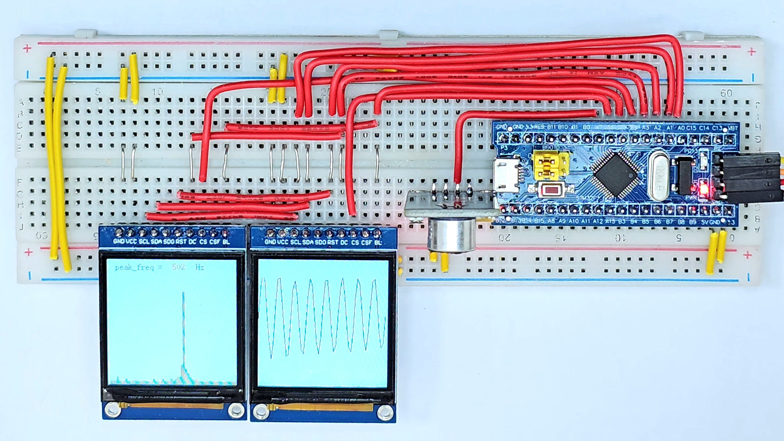
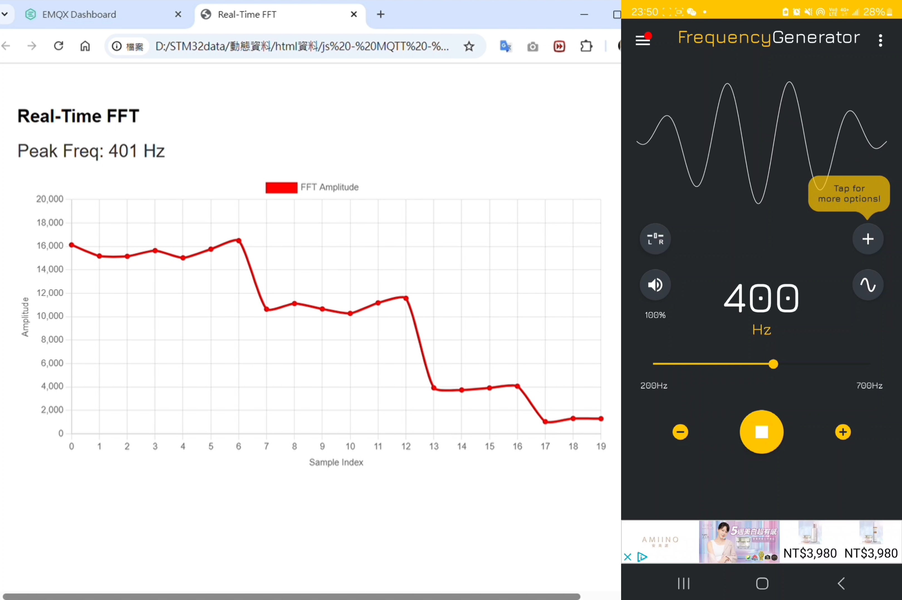

# STM32F103 FFT Display with MQTT and HTML Frontend  
# STM32F103 FFT 頻譜顯示與 MQTT 網頁可視化

This project demonstrates a real-time FFT processing system based on STM32F103RCT6. The system displays waveform and frequency spectrum on dual ST7789 screens, and publishes FFT data to a browser using MQTT + HTML visualization.  
本專案展示一套基於 STM32F103RCT6 的即時 FFT 資料處理系統，透過兩台 ST7789 顯示器顯示波形與頻譜圖，並以 MQTT 協議傳送 FFT 結果至網頁進行動態顯示。

> The three components circled in white in the first image are part of a separate self-balancing vehicle project and are not relevant to this experiment.  
> 第一張圖中白圈圈起的三個元件屬於另個「自平衡車」實驗，本專案不涉及該功能。

---

## 🔧 Hardware Architecture | 硬體架構圖

- STM32F103RCT6 main board  
- ST7789 LCD ×2：Waveform & FFT display  
- ESP8266：Publishes FFT peak via MQTT  
- Microphone module：Analog signal input  
- Rotary Encoder：可擴充 UI 控制用途  

---

## 🎯 Frequency Response Tests | 單頻測試結果

| Frequency 測試頻率 | Result 實驗截圖 |
|------------------|----------------|
| 100 Hz           |  |
| 200 Hz           |  |
| 300 Hz           |  |
| 400 Hz           |  |
| 500 Hz           |  |
| 600 Hz           |  |

Each tone was verified for correct FFT representation.  
每一個單音測試皆能正確對應 FFT 頻率響應。

---

## 🌐 MQTT to HTML Visualization | MQTT 上傳與網頁顯示

- **Left panel 左側圖表**：顯示 MQTT 傳送的 FFT 峰值資料，使用 Chart.js 畫圖  
- **Right panel 右側手機**：播放 400 Hz 測試音，並調整音量測試降噪效果  

HTML 使用 `mqtt.js` 與 `Chart.js` 建構前端，支援動態繪圖。

---

## 📚 References | 參考資料

### ST7789 驅動：
- 使用資料：[03-中景园电子1.3LCD显示屏技术资料] 中所提供的驅動程式碼  

### ESP8266 串接與 Wi-Fi 實作：

- 初始參考：[正点原子] WiFi模組 ATK-ESP8266 資料（舊資料）  
  - 路徑為：  
    `【正点原子】WIFI模块ATK-ESP8266` → `资料（旧资料）` → `2，程序源码` → `扩展实验13 ATK-ESP8266WIFI模块实验`  
  - 說明：此實驗為確認模組連線是否成功的基本流程，我將其作為串接基礎進行修改。

### MQTT 上傳與 EMQX 接入：

- GitHub 專案參考：  
  [`eisbre/STM32_ESP8266`](https://github.com/eisbre/STM32_ESP8266)  
  - 包含 `MQTTKit` 與 `EMQX` 範例  
  - 本專案採用 RTE 提供的 MQTT 函式庫，但連線設定與封包格式參考該專案內容進行調整
